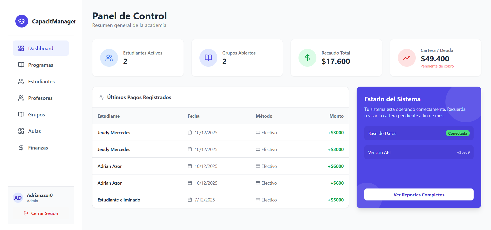

# Sistema de Gestión de Capacitaciones (MERN Stack)

Plataforma integral para la gestión académica y financiera de centros de capacitación. Permite administrar estudiantes, programas, grupos académicos y llevar un control estricto de recaudos y cartera.

## 🚀 Tecnologías

- **Frontend:** React + TypeScript + Vite + Tailwind CSS
- **Backend:** Node.js + Express + TypeScript
- **Base de Datos:** MongoDB (Mongoose)
- **Autenticación:** JWT + Context API

## 📋 Funcionalidades Principales

- **Gestión Académica:** CRUD de Programas, Profesores, Aulas y Estudiantes.
- **Grupos Inteligentes:** Apertura de grupos con validación de horarios y asignación de recursos.
- **Módulo Financiero:**
  - Inscripciones con cálculo de deuda automático.
  - Registro de pagos parciales (Abonos).
  - Reportes de cartera vencida.
- **Calificaciones:** Registro de notas por estudiante.
- **Dashboard:** Métricas en tiempo real de ingresos y actividad.

## 🛠️ Instalación Local

1. **Clonar el repositorio:**
   \`\`\`bash
   git clone <TU_URL_DEL_REPO>
   \`\`\`

2. **Configurar Backend:**
   \`\`\`bash
   cd server
   npm install
   # Crear archivo .env basado en .env.example
   npm run dev
   \`\`\`

3. **Configurar Frontend:**
   \`\`\`bash
   cd client
   npm install
   npm run dev
   \`\`\`

## 📄 Licencia

Este proyecto está bajo la Licencia MIT.
